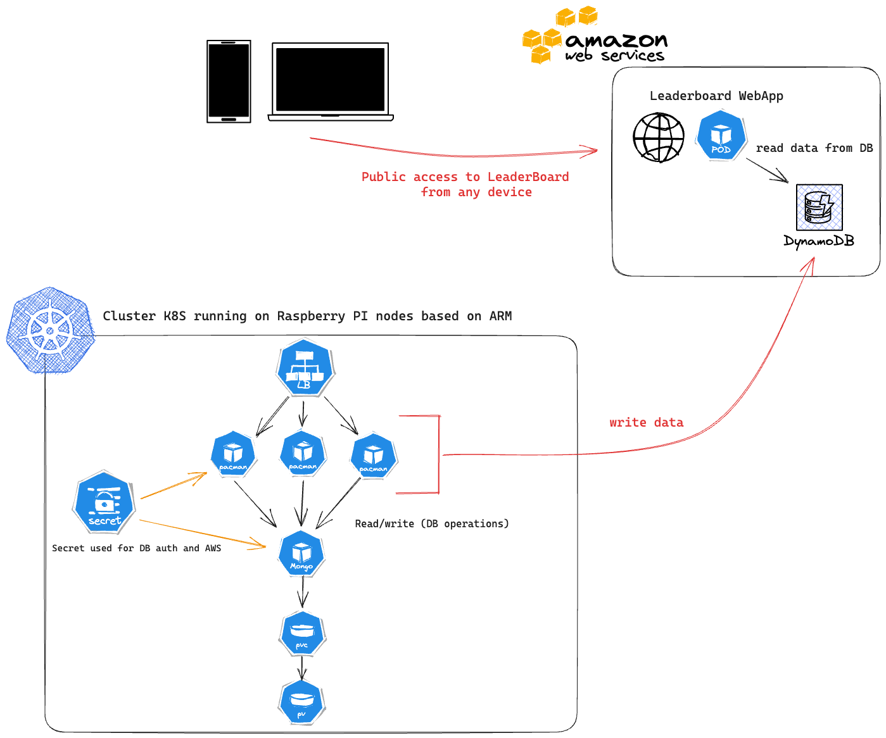

# DESO PACMAN - CodeMotion 2023 @Milano

Pac-Man the classic arcade game - deployment files for any Kubernetes distributions.


## Pre-Reqs

ServiceType: LoadBalancer must be available for external connectivity to the Pac-Man front-end, otherwise you'll need to make some changes to the files in the "services" folder.

## Deployment

### Using a Script for installation
Clone repo and run ```chmod +X pacman-install.sh``` and then run file ```./pacman-install.sh```

or the following steps:

    kubectl create namespace pacman
    kubectl create -n pacman -f pacman/

#### Uninstall using a Script
Run file `./pacman-uninstall.sh`. This will delete all objects created by `./pacman-install.sh`

Alternatively, run `./pacman-uninstall.sh keeppvc`. This will delete all objects except for the pacman namespace and the persistent volume claim. You can use this to demonstrate persistence of the MongoDB data by installing, playing a game and recording a high score, then unininstalling with the `keeppvc` argument. You can then run the installation again and the high score will persist.

## Architecture

The application is made up of the following components:

* Namespace
* Deployment
  * MongoDB Pod
    * DB Authentication configured
    * Attached to a PVC
  * Pac-Man Pod
    * Nodejs web front end that connects back to the MongoDB Pod by looking for the Pod DNS address internally.
* RBAC Configuration for Pod Security and Service Account
* Secret which holds the data for the MongoDB Usernames and Passwords to be configured
* Service
  * Type: LoadBalancer
    * Used to balance traffic to the Pac-Man Pods


